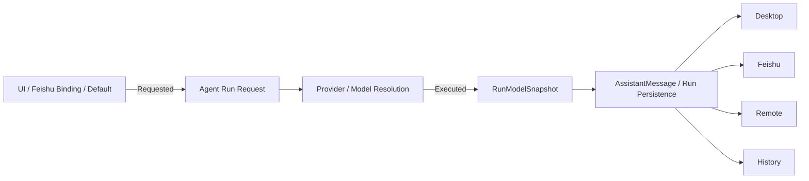

# Global Agent Capabilities、统一模型归因与长运行导航设计

- **Status**: Proposed
- **Date**: 2026-09-14
- **Scope**: Proma Enhanced
- **Priority**: P0
- **Related**: `docs/plans/2026-06-02-im-model-switch-design.md`

> 本文整合三项需要在下一阶段统一解决的问题：全局 Agent 能力配置、每轮实际模型归因，以及长时间运行时的结果导航与滚动体验。三者都涉及“运行时真实状态”和“UI/渠道如何消费该状态”，因此统一定义数据来源、优先级、持久化与回归测试，避免继续在各渠道复制业务逻辑。

## 1. 背景与问题定义

### 1.1 缺少真正的 Global Agent Capability Layer

当前应用已经存在应用级 MCP Sharing / Shared Roots 等能力，但 Agent 自身的 Skills、MCP Servers、Instructions、Constraints、Tool Policy 等仍大量围绕 Workspace / Project 进行组装。结果是：

1. 同一个 Skill 或 MCP 往往需要在多个项目重复配置；
2. MCP 连接定义、认证和启用状态容易产生副本与漂移；
3. Agent 缺少一个统一的“我现在到底拥有哪些能力”的视图；
4. Desktop、Headless、Feishu、Remote Agent 容易各自重新拼装能力；
5. 安全约束无法明确区分“默认值”和“不可被项目取消的全局要求”。

这不是缺一个“全局设置”按钮，而是缺少一个统一的能力解析层。

### 1.2 飞书模型显示来源不是每轮执行事实

已有 IM 模型切换设计允许群绑定模型，并通过 `/model`、`/models` 等命令改变群默认模型。该 Binding 应继续表示“这个群默认/请求哪个模型”，但不能作为最终回复的模型归因。

如果回复 Footer 从静态 Binding 或当前默认模型推导，当用户中途切换模型、发生 fallback、恢复历史 Session，或者 UI Focus 改变后，旧回复和当前回复都有可能显示错误模型。

正确语义必须拆分为：

- **Requested / Preferred Model**：运行前希望使用的模型；
- **Executed Model**：本轮真正执行并产生结果的模型；
- **Displayed Model**：完成态只能来自 Executed Model。

### 1.3 长时间运行缺少高效定位最新结果的导航

工具调用、运行事件、可展示的思考/过程块等持续追加时，运行记录会快速变长。当前体验如果只有鼠标滚轮手动向下，而没有明确可拖动的位置控制、跳到最新入口和“是否继续自动跟随”的状态，长运行会出现：

- 很难快速到达最新结果；
- 用户向上阅读历史内容时，新增内容可能把视口重新拉回底部；
- 动态展开/流式增长的工具块改变高度后，阅读位置发生跳动；
- 极长事件流下，滚动性能和定位能力继续恶化；
- 用户无法明确知道自己距离最新内容还有多少新增事件。

该问题需要作为独立的 Runtime Navigation 能力解决，而不只是增加 CSS 滚动条。

## 2. 目标与非目标

### 2.1 目标

1. Global 能力只配置一次，Project 只保存 Overlay / 差异；
2. 建立唯一的 `EffectiveAgentCapabilitiesResolver`，所有运行入口统一消费；
3. 明确 `Global Required` 与 `Global Default`，强制约束不可被下层取消；
4. Agent 和 UI 都能查看当前实际生效能力及其来源；
5. 建立 per-run 模型快照，Desktop / Feishu / Remote / History 使用同一归因来源；
6. fallback 后显示实际执行模型，而不是默认模型；
7. 长运行中提供可拖动滚动位置、自动跟随/暂停跟随、未读事件计数和一键跳到最新；
8. 动态内容高度变化时保持阅读锚点；
9. 为超长事件流预留虚拟化能力；
10. 保持旧项目和旧消息兼容，并提供可回滚迁移路径。

### 2.2 非目标

- 本阶段不新增 Tunnel Provider；
- 不通过 UI 暴露原本不可见的内部推理或隐藏 Chain of Thought；Runtime Navigation 只作用于当前产品已经允许展示的运行内容；
- 不重写全部聊天 UI；
- 不因为此次设计进行整包 upstream merge；
- 不把完整 Skill 文档、所有 MCP Tool Schema 一次性塞进 Prompt，能力详情继续 Lazy Load。

## 3. 总体架构

```text
Global Required
       +
Global Default
       ↓
Project Overlay
       ↓
Session Override
       ↓
Turn Override
       ↓
EffectiveAgentCapabilitiesResolver
       ↓
Agent Run
 ├─ EffectiveCapabilitiesSnapshot
 ├─ RunModelSnapshot
 └─ RuntimeEventStream
       ↓
AssistantMessage / Run Persistence
       ↓
Desktop / Feishu / Remote / History
       ↓
Runtime Navigation Controller
```

核心原则：

1. **Single Source of Truth**：能力、模型归因、运行事件都只能有一个权威解析结果；
2. **Requested != Executed**：默认/请求模型和实际模型是两个概念；
3. **Required Cannot Be Relaxed**：全局强制策略只能被进一步收紧；
4. **User Scroll Wins**：用户主动向上阅读时，新增内容不得抢夺视口；
5. **Lazy Detail**：Agent 先知道能力清单和状态，详细内容按需加载；
6. **No False Attribution**：拿不到实际模型时显示 Unknown，也不能用静态 Binding 伪造“实际模型”。

## 4. Global Agent Capability Layer

### 4.1 配置层级

统一采用以下层级：

```text
Global Required
Global Default
      ↓
Project Overlay
      ↓
Session Override
      ↓
Turn Override
```

语义：

- `Global Required`：所有项目必须遵守，只能进一步收紧；
- `Global Default`：所有项目默认继承，项目可显式禁用或覆盖；
- `Project Overlay`：只保存相对 Global 的差异，不复制完整定义；
- `Session Override`：当前 Session 临时配置；
- `Turn Override`：单轮运行临时配置，生命周期最短。

### 4.2 推荐数据结构

```ts
type CapabilitySource =
  | 'global-required'
  | 'global-default'
  | 'project'
  | 'session'
  | 'turn'

interface GlobalAgentProfile {
  schemaVersion: 1
  skills: GlobalSkillRegistryEntry[]
  mcpServers: GlobalMcpRegistryEntry[]
  instructions: InstructionRef[]
  constraints: ConstraintRule[]
  toolPolicy: ToolPolicy
  defaultModels?: ModelDefaults
}

interface ProjectAgentOverlay {
  inheritGlobal: boolean

  skills?: {
    enable?: string[]
    disable?: string[]
  }

  mcp?: {
    enable?: string[]
    disable?: string[]
  }

  instructions?: InstructionRef[]
  constraints?: ConstraintRule[]
  toolPolicy?: Partial<ToolPolicy>
  model?: Partial<ModelDefaults>
}

interface EffectiveAgentCapabilities {
  resolverVersion: number
  effectiveHash: string
  skills: ResolvedSkill[]
  mcpServers: ResolvedMcpServer[]
  tools: ResolvedTool[]
  constraints: ResolvedConstraint[]
  sharedRoots: ResolvedSharedRoot[]
  model: ResolvedModelPolicy
}
```

所有 `Resolved*` 项都应携带：

```ts
interface CapabilityResolutionMeta {
  source: CapabilitySource
  enabled: boolean
  required: boolean
  status: 'ready' | 'disabled' | 'error' | 'missing'
  reason?: string
}
```

### 4.3 Global Skills Registry

Skill 安装/注册一次，由项目引用 ID：

```text
Global Skills
├─ code-review
├─ frontend-design
└─ security-audit

Project A
└─ inherit all

Project B
└─ disable frontend-design
```

Global Registry 记录 Skill 的标识、位置、版本/校验信息、默认启用状态；项目不再复制整个 Skill 目录作为唯一继承方式。

### 4.4 Global MCP Registry

MCP Server Definition 和凭据只保存一次：

```text
GlobalMcpRegistry
├─ github
├─ postgres
├─ browser
└─ filesystem-x

Project A → github
Project B → github + postgres
```

推荐结构：

```ts
interface GlobalMcpRegistryEntry {
  id: string
  name: string
  transport: McpTransportConfig
  credentialRef?: string
  defaultEnabled: boolean
  required?: boolean
}
```

要求：

- `credentialRef` 只引用安全存储，不把 Secret 复制进 Project Overlay；
- `EffectiveAgentCapabilities` 不包含明文凭据；
- Project 只引用 Server ID；
- 同一个 Server 在不同项目的启停互不修改全局 Definition。

### 4.5 Resolver 算法

`EffectiveAgentCapabilitiesResolver` 应成为所有运行入口唯一能力解析器：

1. 读取 `Global Required`；
2. 读取 `Global Default`；
3. 应用 `Project Overlay`；
4. 应用 Session / Turn Override；
5. 解析依赖、Skill/MCP ID 和工具暴露状态；
6. 最后再次执行 Required Enforcement；
7. 对受保护操作采用 Deny-Wins；
8. 标记缺失/损坏引用，不静默忽略；
9. 为每一项记录 `source/reason/status`；
10. 生成稳定 `effectiveHash`，用于调试、缓存和运行快照。

安全优先级示例：

```text
Global Required: shell.delete = deny
Project:         shell.delete = allow
Result:          deny
```

### 4.6 Effective Capabilities Inspector

Settings 和 Project UI 增加可解释视图：

```text
code-review        Global Default   Ready
security-policy    Global Required  Ready
github             Global Default   Ready
frontend-design    Project          Ready
legacy-mcp         Project          Error
```

至少展示：

- Skills；
- MCP Servers；
- MCP Ready/Error；
- 暴露 Tools 数量；
- Constraints；
- Shared Roots；
- Tool Policy；
- 默认/本轮模型策略；
- 每项来源。

Agent Session 建立时只注入精简摘要，例如：

```text
Available Skills: 8
MCP Servers: GitHub, Browser, Postgres
Shared Roots: 4
Write: enabled
Shell: approval required
Required Constraints: 3
```

详细 Skill 内容与 Tool Schema 继续按需读取。

## 5. 统一模型归因（Unified Model Attribution）

### 5.1 语义调整

`FeishuGroupBinding.modelId` 保留，但语义明确为：

> 群聊默认/请求使用的模型。

它不再承担：

> 当前这条 Assistant 回复实际由哪个模型执行。

### 5.2 RunModelSnapshot

```ts
interface RunModelSnapshot {
  requested?: {
    channelId?: string
    modelId?: string
  }

  executed?: {
    channelId?: string
    channelName?: string
    modelId: string
    modelName?: string
  }

  fallback?: {
    used: boolean
    fromModelId?: string
    reasonCode?: string
  }

  capturedAt: string
}
```

原则：实际模型一旦确定并开始执行，本轮 Snapshot 就不可被后续 UI Focus、群 Binding、默认模型修改所重写。

### 5.3 数据流



最终显示解析优先级：

```text
assistantMessage.runModel.executed
    ↓
persistedRun.runModel.executed
    ↓
Unknown / 旧版本未记录
```

**禁止**在最终 Footer 中 fallback 到：

- 当前 `FeishuGroupBinding.modelId`；
- 当前 Settings 默认模型；
- UI 当前 Focus 模型。

因为这些值都不能证明这条历史回复的实际执行模型。

### 5.4 Streaming 和 Fallback

运行刚开始且 Executed Model 尚未确定时：

- 可以不显示模型；或
- 显示“计划模型：A”。

Executed Model 确定后：

```text
实际模型：B
```

若 Requested A，但 A 失败后 fallback 到 B：

```text
Model: B
```

高级详情可显示：

```text
Requested: A
Executed: B
Fallback: yes
```

### 5.5 历史消息

旧消息如果没有 per-run model metadata：

```text
模型：未知（旧版本未记录）
```

不能根据“现在的群 Binding”重新推导过去使用的模型，否则历史审计信息会随着设置变化而变化。

### 5.6 与既有 IM 模型切换设计的关系

`docs/plans/2026-06-02-im-model-switch-design.md` 中的群模型选择、`/model`、`/models`、默认模型和 Binding 逻辑继续有效。

此次设计仅补充/修正模型归因语义：

- Binding = requested/default preference；
- Run snapshot = actual execution truth；
- Footer/history = executed model only。

## 6. 长运行 Runtime Navigation

### 6.1 P0 UX 要求

#### A. 始终提供可拖动的位置控制

运行内容的实际滚动容器必须支持：

```css
.runtime-scroll-container {
  overflow-y: auto;
  scrollbar-gutter: stable;
}
```

不得通过样式隐藏 scrollbar thumb。若平台使用自定义 Scrollbar，也必须提供与原生滚动条等价的拖拽定位、鼠标、触控板和键盘可访问性。

目标是让用户可以直接拖动滑块从超长运行的任意位置跳到靠近底部，而不是只能重复滚轮滚动。

#### B. 浮动“跳到最新”入口

当用户不在底部时，在输入区上方显示：

```text
↓ 最新
```

有新增事件时：

```text
↓ 最新 · 17
```

点击后：

1. 跳到运行结果最底部；
2. 恢复自动跟随；
3. 清空 pending event count。

#### C. 自动跟随状态机

```ts
type RuntimeScrollMode = 'following' | 'paused'

interface RuntimeNavigationState {
  mode: RuntimeScrollMode
  isAtBottom: boolean
  pendingEventCount: number
  anchorEventId?: string
  lastVisibleEventId?: string
}
```

规则：

- 距离底部 `<= 48px`：视为 `following`；
- 用户主动 Wheel Up、拖动 Scrollbar 向上、PageUp、Home 等离开底部：切换为 `paused`；
- `paused` 时新事件追加不得改变当前 viewport；
- `paused` 时新增事件只增加 `pendingEventCount`；
- 用户滚回底部、按 End/Ctrl+End 或点击“最新”：恢复 `following`；
- `following` 时流式追加内容保持尾部 pinned。

### 6.2 动态高度与阅读锚点

工具调用和运行过程块会流式增长，也可能展开/折叠。仅依赖 `scrollTop = scrollHeight` 会导致阅读中频繁跳动。

实现建议：

- 使用 end sentinel + `IntersectionObserver` 判断是否在底部；
- 使用 `ResizeObserver` 观察动态块高度变化；
- 更新合并到 `requestAnimationFrame`；
- `following` 模式：保持 end sentinel 可见；
- `paused` 模式：记录第一个稳定可见 `eventId + offset` 作为 anchor；
- anchor 上方内容高度变化时补偿 scroll offset，保持视觉位置不变。

伪代码：

```ts
onContentAppended(eventId) {
  if (state.mode === 'following') {
    scheduleScrollToEnd()
    return
  }

  state.pendingEventCount += 1
}

onContentResized(eventId) {
  if (state.mode === 'following') {
    scheduleScrollToEnd()
    return
  }

  preserveVisibleAnchor()
}

jumpToLatest() {
  state.mode = 'following'
  state.pendingEventCount = 0
  scrollEndSentinelIntoView()
}
```

### 6.3 RuntimeNavigationController

```ts
interface RuntimeNavigationController {
  onScroll(metrics: ScrollMetrics): void
  onUserScrollIntent(direction: 'up' | 'down'): void
  onContentAppended(eventId: string): void
  onContentResized(eventId: string): void
  jumpToLatest(): void
  setFollowMode(enabled: boolean): void
}
```

该 Controller 只负责导航，不负责解析 Tool/Reasoning 的业务内容。

### 6.4 运行块折叠

对产品当前已经允许显示的工具调用/过程内容：

- 已完成的长块支持单块折叠；
- 可提供“收起已完成详情”；
- 用户手动折叠后，新事件不能自动重新打开；
- Running 中的当前块保持状态可见；
- 折叠行为不能暴露任何原本未展示的内部推理内容。

### 6.5 超长运行虚拟化

当 Runtime Event 数量达到阈值后启用列表虚拟化/窗口化，要求：

- Event 必须有稳定 `eventId`；
- 动态行高可测量；
- 虚拟化后仍能维持 anchor；
- “跳到最新”直接定位末尾 Event，而不是先渲染所有中间节点；
- 至少针对 2,000+ Runtime Events 做 E2E 压测；
- 折叠/展开后虚拟列表重新测量时不丢失用户阅读位置。

### 6.6 可选 Phase 2：Runtime Event Rail

如果长运行仍然难以导航，可增加右侧事件轨道：

```text
assistant   ┃
tool        ●
tool        ●
approval    ◆
error       !
latest      ▼
```

支持：

- 点击 marker 跳到事件；
- 拖动 rail thumb 按事件索引快速定位；
- Tool / Approval / Error 使用不同语义 marker；
- 在虚拟化情况下映射到 Event Index，不依赖 DOM 全量渲染。

该能力不是 P0；P0 先完成“可见可拖动 Scrollbar + Following/Paused + Jump to Latest”。

### 6.7 Accessibility

- “跳到最新”必须可 Tab Focus；
- `aria-label="跳到最新运行结果"`；
- 支持 End / Ctrl+End；
- 支持键盘 PageUp / PageDown；
- `prefers-reduced-motion` 下使用 instant scroll，避免强制 smooth animation；
- Focus Ring 不能被隐藏。

## 7. 运行与持久化数据边界

### 7.1 应持久化

- `GlobalAgentProfile`：应用级；
- `ProjectAgentOverlay`：项目级；
- `RunModelSnapshot`：每轮运行/Assistant Message；
- `EffectiveCapabilitiesSnapshot`：建议在 Run 上记录 compact snapshot/hash，便于审计和复现；
- `RuntimeEvent.eventId/kind/status/timestamps`：按现有运行记录策略保存。

### 7.2 默认不持久化

Runtime Navigation 的以下状态默认只属于当前 UI Session：

- `scrollTop`；
- `pendingEventCount`；
- `following/paused`；
- 临时 viewport anchor。

如果以后需要恢复“上次阅读位置”，再单独设计 Session-level UI preference，避免本阶段扩大持久化面。

### 7.3 Runtime Event 基础契约

为了支持稳定导航，Runtime Event 至少需要：

```ts
interface RuntimeEvent {
  eventId: string
  kind: 'assistant' | 'tool' | 'approval' | 'status' | 'error' | 'runtime-detail'
  status?: 'pending' | 'running' | 'completed' | 'failed'
  createdAt: string
  parentEventId?: string
}
```

不要把 Secret、Credential 或隐藏推理文本加入导航索引。

## 8. 错误处理原则

### 8.1 能力解析

- Global MCP 连接失败：显示 `error`，不能静默消失；
- Skill/MCP ID 丢失：标记 `missing` 并给出来源；
- Required Rule 冲突：安全侧规则优先，阻止运行或明确降级；
- Resolver 失败：可以临时回退 Legacy Loader，但必须记录结构化错误。

### 8.2 模型归因

- Executed Model 不可获得：显示 `Unknown`；
- 不允许用当前 Binding/Default 猜测；
- 历史消息不回写“推测模型”。

### 8.3 Runtime Navigation

- 自定义 Controller 失败时，必须保留原生可滚动容器；
- “跳到最新”异常不能导致聊天内容不可滚动；
- 虚拟化异常时允许降级成非虚拟列表，而不是丢失事件。

## 9. Observability

建议增加不包含敏感内容的结构化事件：

```text
capabilities.resolved
- resolverVersion
- effectiveHash
- skillCount
- mcpCount
- toolCount
- constraintCount
- sourceCounts

model.attribution
- requestedModelId
- executedModelId
- fallbackUsed
- fallbackReasonCode

runtime_navigation (dev/debug only)
- fromMode
- toMode
- pendingEventCount
- action: jump_to_latest / manual_scroll / reached_bottom
```

禁止记录：

- MCP Secret；
- Auth Token；
- 完整 Prompt；
- 隐藏思考内容；
- 不必要的用户正文。

## 10. 实现落点

实现 PR 应按当前仓库实际模块边界落代码，不再为每个渠道复制一套业务规则。逻辑职责建议如下：

| 模块 | 职责 |
|---|---|
| Agent Orchestration / Session Construction | 调用统一 Capability Resolver；创建 Run Snapshot |
| Workspace / Project Manager | Project Overlay 读写与 Legacy Migration |
| Global Settings | Global Skills/MCP/Constraints/Tool Policy 管理 |
| Capability Resolver | 合并层级、Required Enforcement、状态解释、effectiveHash |
| Assistant Message / Run Persistence | 保存 `RunModelSnapshot` 与 compact capability snapshot |
| Feishu Binding / Router | Binding 只负责 requested/default model |
| Feishu Card Renderer | 从 persisted executed model 渲染 Footer |
| Desktop / Remote / History | 共用 `resolveExecutedModelDisplay()` |
| Runtime Transcript / Chat Surface | Scroll container、navigation controller、anchor、Latest button |
| Runtime Event List | 稳定 eventId、折叠、虚拟化 |

禁止出现：

- Desktop 一套 Capability Merge，Feishu 再复制一套；
- Feishu 单独实现模型显示 fallback；
- 每个 Runtime Block 自己管理 auto-scroll。

## 11. 迁移策略

### 11.1 Global Capability Migration

第一阶段必须保证行为等价：

1. 新增 Global Profile Schema，但初始允许为空；
2. 旧 Workspace/Project 配置转换成 Project Overlay；
3. Global 为空时，解析结果应与迁移前一致；
4. 不自动根据“长得像”就合并 MCP Server 或 Credentials；
5. 提供 Migration Report，列出重复 Skill/MCP Definition；
6. 用户显式确认后，才能把重复项 Promote 到 Global Registry；
7. 保留 Legacy Loader Feature Flag，直到迁移通过回归测试。

### 11.2 Model Attribution Migration

- 新运行开始写 `RunModelSnapshot`；
- 旧 Assistant Message 字段保持兼容；
- 无 Snapshot 的历史消息显示 Unknown；
- 不做危险的历史推断/批量回填。

### 11.3 Runtime Navigation Migration

Runtime Navigation 默认不改变消息数据格式；先只替换 UI 的滚动/跟随控制。如果现有 Runtime Event 缺少稳定 ID，再单独补事件 ID 迁移。

## 12. Feature Flags 与回滚

建议：

```text
globalAgentProfileV1
perRunModelAttribution
runtimeNavigationV1
```

回滚原则：

- `globalAgentProfileV1=false`：回到 Legacy Workspace capability loader；
- `perRunModelAttribution=false`：宁可不显示无法确认的模型，也不要退回错误 Binding 归因；
- `runtimeNavigationV1=false`：回到原生 Scroll Container，确保基本浏览能力始终可用。

## 13. 测试计划

### 13.1 Capability Resolver Unit Tests

至少覆盖：

1. Global Default 被 Project Disable；
2. Global Required 无法被 Project Disable；
3. Project 新增 Skill；
4. Session / Turn Override 优先级；
5. Required Deny 与 Project Allow 冲突时 Deny-Wins；
6. 缺失 Skill/MCP 引用显示 missing；
7. MCP Server Ready/Error 状态可解释；
8. 同一 Global MCP 被多个 Project 引用但 Definition 只有一份；
9. Global 为空时与 Legacy 行为等价；
10. 相同输入生成稳定 `effectiveHash`。

### 13.2 Model Attribution Integration Tests

| 场景 | 最终显示 |
|---|---|
| 群初始 A，第一条回复 | A |
| 切换 B 后第二条回复 | B |
| 再切换 C | C |
| 历史第一条 A | 仍然 A |
| Requested B，Fallback C | C |
| 两个群分别 A/B | 各自实际模型 |
| App 重启后继续 Session | 本轮实际模型 |
| 老消息无 Snapshot | Unknown，不显示当前 Binding |

必须通过完整链路验证：

```text
Feishu Message
→ Agent Run
→ RunModelSnapshot
→ AssistantMessage Persistence
→ Card Update
```

不能只测 `resolveModelDisplay(binding)` 之类的局部函数。

### 13.3 Runtime Navigation Unit / E2E Tests

1. 位于底部时，新事件自动跟随；
2. 用户向上滚动后切换 paused；
3. paused 时连续新增 50 条事件，viewport 不移动；
4. pending count 正确增加；
5. 点击“最新”回到底部并清零 pending；
6. 拖动 scrollbar thumb 可快速跳到靠近底部；
7. 上方 Tool Block 增高时保持当前 anchor；
8. 折叠/展开已完成 Tool Block 不丢失阅读位置；
9. 2,000+ Runtime Events 下仍可滚动和 Jump-to-Latest；
10. 虚拟化后 Event ID 跳转正确；
11. End/Ctrl+End 生效；
12. Reduced Motion 下不执行强制 smooth scroll；
13. 用户 paused 时任何流式 token/update 都不能强制拉回底部；
14. 点击正在运行块、复制内容、选择文本时不意外恢复 following。

## 14. 验收标准

### 14.1 CAP

- **CAP-01**：同一 Skill 只需全局配置一次，至少两个 Project 可继承使用；
- **CAP-02**：Global Default 可被 Project 显式禁用；
- **CAP-03**：Global Required 不可被 Project/Session/Turn 放宽；
- **CAP-04**：同一 MCP Definition/Credential 不需在多个 Project 重复保存；
- **CAP-05**：UI 可查看所有 Effective Capabilities 的来源和状态；
- **CAP-06**：断开的 MCP/缺失 Skill 有明确 Error/Missing 状态；
- **CAP-07**：空 Global Profile 时旧项目行为保持一致。

### 14.2 MOD

- **MOD-01**：初始 A 的回复显示 A；
- **MOD-02**：切换 B 后新回复显示 B；
- **MOD-03**：切换 B 后历史 A 仍显示 A；
- **MOD-04**：Requested B、Fallback C 时显示 C；
- **MOD-05**：应用重启后历史归因不改变；
- **MOD-06**：多个群独立运行不会串模型；
- **MOD-07**：没有实际模型数据时显示 Unknown，而不是当前 Binding。

### 14.3 NAV

- **NAV-01**：长运行区域始终存在可拖动的滚动位置控制；
- **NAV-02**：不在底部时，一次操作即可跳到最新；
- **NAV-03**：在底部时新内容实时跟随；
- **NAV-04**：用户主动向上阅读后不再被自动拉回；
- **NAV-05**：暂停跟随时能看到新增事件数量；
- **NAV-06**：动态内容增高/展开时阅读锚点保持稳定；
- **NAV-07**：已完成的长运行块可折叠；
- **NAV-08**：2,000+ 事件下定位和滚动仍可用；
- **NAV-09**：键盘和 Reduced Motion 满足基本可访问性；
- **NAV-10**：导航优化不会暴露任何此前不可见的内部推理内容。

## 15. 建议实施顺序

### PR 1 — Shared Contracts & Tests

- `GlobalAgentProfile` / `ProjectAgentOverlay` / `EffectiveAgentCapabilities` 类型；
- `RunModelSnapshot`；
- Runtime Navigation State / Event ID contract；
- 先落 Unit Test 和接口，不改主行为。

### PR 2 — Per-run Model Attribution

- Agent Run 捕获 Executed Model；
- Assistant Message 持久化；
- Feishu/Desktop/Remote/History 统一读取；
- 补完整 fallback 和历史测试。

这是最小、最明确、可以先独立交付的 correctness fix。

### PR 3 — Runtime Navigation P0

- 可见可拖动 Scrollbar；
- Following/Paused；
- `↓ 最新 · N`；
- Resize/Anchor 处理；
- 键盘与 E2E；
- 如已有事件量压力，再同时启用虚拟化。

### PR 4 — Global Registry & Resolver

- Global Skills Registry；
- Global MCP Registry；
- Global Required/Default；
- Project Overlay；
- Resolver + effectiveHash；
- Legacy migration/flag。

### PR 5 — Management UI & Effective Inspector

- Global Agent Profile 设置页；
- Project Overlay 设置；
- Effective Capabilities Inspector；
- Migration Report / Promote-to-Global；
- 稳定后再评估 Legacy Loader 删除。

## 16. 安全与隐私

1. Required Constraints 不允许下层配置取消；
2. MCP Credential 只通过 `credentialRef` 使用；
3. Effective Snapshot 不保存 Secret；
4. Model Attribution 不记录无关 Prompt 正文；
5. Runtime Navigation 只组织当前允许展示的事件，不新增隐藏推理暴露面；
6. Logs/Telemetry 不记录隐藏思考、Token、Credential；
7. `effectiveHash` 仅基于非敏感、确定性配置摘要计算。

## 17. Upstream 策略

当前阶段不应因为这三项工作做无差别 upstream merge。Proma Enhanced 已在 MCP、Remote、Feishu、Agent Orchestration 等区域形成较深改造，后续继续按类别处理：

| 上游变化 | 建议 |
|---|---|
| Provider SDK / Auth | 优先同步 |
| Model Catalog | 优先同步 |
| 通用 Agent Session Bug | 审查后同步 |
| 通用工具 Bug | Cherry-pick |
| UI 小修 | 按价值选择 |
| Workspace / Agent Orchestrator | 手工 Port |
| 上游 MCP 架构 | 不直接覆盖 Enhanced |
| Feishu / Remote | 逐文件比较 |
| Release / Docs / Version | 通常不需要单独同步 |

能力解析、运行模型归因和 Session State 都属于 fork 深改区域，应优先保护 Enhanced 的单一真相来源，而不是依赖整包 merge 修复。

## 18. Definition of Done

该设计完成的标准不是“页面上出现了三个新功能”，而是：

- [ ] 所有 Agent 入口统一使用 Capability Resolver；
- [ ] Global / Project / Session / Turn 优先级有自动化测试；
- [ ] Required Constraints 无法被绕过；
- [ ] Agent/UI 能解释有效能力来源；
- [ ] 所有渠道的最终模型显示只来自 per-run executed metadata；
- [ ] 模型切换和 fallback 不再产生错误 Footer；
- [ ] 长运行可拖动定位，且有 Jump-to-Latest；
- [ ] 用户向上阅读期间不会被强制自动滚回；
- [ ] 动态 Runtime Block 不破坏阅读锚点；
- [ ] 超长运行通过性能/E2E 验证；
- [ ] Legacy Migration 和 Feature Flag 可回滚；
- [ ] 文档、类型、迁移、Unit/Integration/E2E 测试全部合入。

## 19. Decision Log

1. **能力采用 Registry + Overlay，而不是项目复制完整配置。**
2. **Global Default 与 Global Required 分离。**
3. **EffectiveAgentCapabilitiesResolver 是运行时唯一能力真相来源。**
4. **Group Binding / Default Model 只代表 requested preference。**
5. **最终模型归因只能来自 executed model；无法确认时显示 Unknown。**
6. **Runtime Navigation P0 必须包含可拖动滚动位置 + Jump-to-Latest，而不是只优化滚轮速度。**
7. **用户主动滚动优先于自动跟随。**
8. **导航功能不得扩大内部推理暴露范围。**
9. **当前阶段不依赖 upstream merge 解决上述架构问题。**
