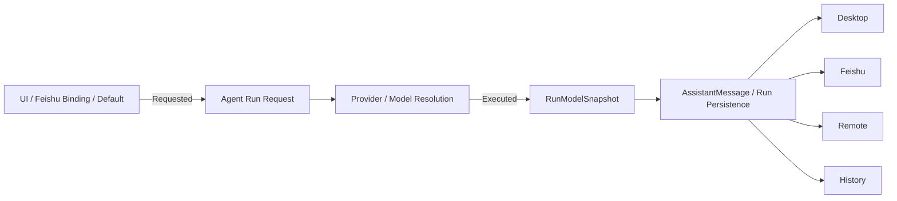

# Proma Enhanced v1.14 上游同步、Agent 能力与运行时一致性开发执行指南

- **Status**: Accepted / In Progress
- **Created**: 2026-09-14
- **Updated**: 2026-09-21
- **Audience**: Proma Enhanced 开发与维护人员
- **Scope**: 上游主分支同步、每轮实际模型归因、长运行导航补缺、Global Agent Capability Layer
- **Priority**: P0 → P1
- **Execution batch**: `20260921-2227-v114-upstream-agent-architecture`
- **Related**: `docs/plans/2026-06-02-im-model-switch-design.md`

> 本文是本轮开发的单一执行规格和进度账本。开发只同步已经进入 `proma-ai/Proma` 的 `upstream/main`；任何上游未合并 PR 都不进入合并范围。本仓库 PR #1 只承载本文档，代码开发必须按本文阶段顺序进行，并在每个验证门完成后更新进度记录。

## 0. 执行摘要与不可变边界

### 0.1 当前基线

| 项目 | 基线 |
|---|---|
| Enhanced `main` / `origin/main` | `97f8fbd5f4624a30867d156c97585a29ac78002e`（v1.13.2） |
| 上次已合并的 upstream | `f99edbdb594407ab190b97ae073889c5d96637ab` |
| 本轮目标 upstream/main | `4e96c5e859302c4a34618d45db352b29a7ebeb28` |
| 上游增量 | 24 commits / 50 files |
| 当前 Electron / shared / Pi | `1.13.2` / `0.8.1` / `0.85.1` |
| 目标开发版本 | Electron `1.14.0`；其他包按实际契约变化递增 |

上游的 `v0.19.57` 与 `v0.19.62` 标签当前都指向 `4e96c5e8`，源码 Electron 版本仍为 `0.19.57`，GitHub Latest Release 仍为 `v0.19.53`。因此本轮只能以提交 SHA 为同步依据，不能用上游标签名称推断内容或稳定性。

### 0.2 不可变边界

1. 只合并 `upstream/main@4e96c5e8`；不合并、cherry-pick 或复制上游开放 PR 分支。
2. 保留 Enhanced 的 V13/V14 MCP Sharing、ChatGPT capability awareness、Agent Action、本地审批、Workspace 绑定和逐调用授权。
3. 保留 Enhanced 的 Codex OAuth、Fork Release 来源、自建模型推理档位和显式项目指令边界。
4. Pi runtime 只使用 Pi；不得重新引入 Claude Agent SDK 或其 session/config 语义。
5. Global Agent Capability Layer 是 Proma 内部 Agent 装配层；V14 MCP Sharing 是对外暴露层。二者可以共享只读摘要，但不得共享授权状态或绕过各自策略。
6. 长运行导航复用现有 `StickToBottom`、`ScrollMinimap`、`TaskProgressOverlay` 和位置恢复逻辑；除非现有抽象无法满足测试，不新增平行导航框架。
7. 配置持久化继续使用 JSON/JSONL 和 `safe-file.ts` 原子写；Secret 只保存引用，不进入能力快照、日志或项目 Overlay。
8. 每个阶段都必须先通过专项测试，再进入下一阶段；失败时回退当前阶段，不携带未验证代码继续开发。

### 0.3 总体开发顺序

| 阶段 | 内容 | 进入条件 | 完成门槛 | 状态 |
|---|---|---|---|---|
| Phase 0 | 修订并合入执行文档 | PR #1 可更新 | 文档、版本和 PR 检查完成 | 待合并 |
| Phase 1 | 合并 upstream/main | Phase 0 已合入 | 冲突清零；旧功能与上游新增功能测试通过 | 未开始 |
| Phase 2 | Per-run 模型归因 | Phase 1 基线稳定 | requested/executed/fallback 持久化及跨渠道测试通过 | 未开始 |
| Phase 3 | 长运行导航补缺 | Phase 2 不再改变消息契约 | 未读计数、键盘、Reduced Motion、锚点与压力验证通过 | 未开始 |
| Phase 4 | Global Capability Resolver | 前三阶段稳定 | 解析优先级、Deny-Wins、空配置等价和稳定 hash 测试通过 | 未开始 |
| Phase 5 | Registry、迁移与 Inspector UI | Resolver 契约冻结 | 原子迁移、管理 UI、来源解释和回滚开关通过 | 未开始 |
| Phase 6 | 集成、版本与发布准备 | 所有验收项完成 | 全量测试、构建、打包冒烟和人工清单完成 | 未开始 |

开发过程中若发现真实代码边界与本文不一致，应先在第 20 节记录证据和调整，再修改阶段范围。不得静默偏离文档。

### 0.4 已知未知项

- Pi 0.86.1 是否改变 Enhanced 受限工具运行的边缘行为，要由 Phase 1 专项测试确认；不能仅凭类型检查判断兼容。
- Provider/Pi 若没有可靠的 fallback 完成信号，Phase 2 只记录 requested 与实际执行模型，不根据错误文本构造 fallback reason。
- 2,000+ 事件的性能阈值将在 Phase 3 同一台参考 Windows 环境建立基线后固定；在此之前不承诺虚拟化，也不以主观滚动感受替代测量。
- Global Registry 的首次迁移可能发现同名但不同配置的 MCP。它们默认保持独立，只有用户确认后才 Promote/合并。

## 1. 背景与问题定义

### 1.1 缺少真正的 Global Agent Capability Layer

当前应用已经存在应用级 MCP Sharing / Shared Roots 等能力，但 Agent 自身的 Skills、MCP Servers、Instructions、Constraints、Tool Policy 等仍大量围绕 Workspace / Project 进行组装。结果是：

1. 同一个 Skill 或 MCP 往往需要在多个项目重复配置；
2. MCP 连接定义、认证和启用状态容易产生副本与漂移；
3. Agent 缺少一个统一的“我现在到底拥有哪些能力”的视图；
4. Desktop、Headless、Feishu、Remote Agent 容易各自重新拼装能力；
5. 安全约束无法明确区分“默认值”和“不可被项目取消的全局要求”。

这不是缺一个“全局设置”按钮，而是缺少一个统一的能力解析层。

### 1.2 飞书模型显示来源不是每轮执行事实

已有 IM 模型切换设计允许群绑定模型，并通过 `/model`、`/models` 等命令改变群默认模型。该 Binding 应继续表示“这个群默认/请求哪个模型”，但不能作为最终回复的模型归因。

如果回复 Footer 从静态 Binding 或当前默认模型推导，当用户中途切换模型、发生 fallback、恢复历史 Session，或者 UI Focus 改变后，旧回复和当前回复都有可能显示错误模型。

正确语义必须拆分为：

- **Requested / Preferred Model**：运行前希望使用的模型；
- **Executed Model**：本轮真正执行并产生结果的模型；
- **Displayed Model**：完成态只能来自 Executed Model。

### 1.3 长运行导航已有基础，但缺少完整验收闭环

当前代码已经具备以下能力：

- `Conversation` 使用 `use-stick-to-bottom` 管理自动跟随；
- `ScrollMinimap` 提供消息位置、搜索、轨道点击和可拖动滑块；
- `TaskProgressOverlay` 在离开底部时提供回到底部入口；
- `AgentMessages` 在前插历史消息时补偿高度，避免阅读位置跳动；
- `IntersectionObserver`、`ResizeObserver` 和滚动位置恢复已用于现有链路。

因此本轮不重新设计导航系统，只补齐经源码核对仍缺少的能力：

- paused 状态下的新增事件数量；
- 自定义滑块的键盘与 ARIA 等价能力；
- End / Ctrl+End 与 `prefers-reduced-motion`；
- 动态 Tool Block 在阅读锚点上方增高时的确定性补偿；
- 2,000+ 事件压力基线，以及达到实测阈值后才启用的虚拟化。

## 2. 目标与非目标

### 2.1 目标

1. Global 能力只配置一次，Project 只保存 Overlay / 差异；
2. 建立唯一的 `EffectiveAgentCapabilitiesResolver`，所有运行入口统一消费；
3. 明确 `Global Required` 与 `Global Default`，强制约束不可被下层取消；
4. Agent 和 UI 都能查看当前实际生效能力及其来源；
5. 建立 per-run 模型快照，Desktop / Feishu / Remote / History 使用同一归因来源；
6. fallback 后显示实际执行模型，而不是默认模型；
7. 在现有长运行导航上补齐未读事件计数、键盘操作与 Reduced Motion；
8. 验证并补齐动态内容高度变化时的阅读锚点；
9. 建立超长事件流性能基线，只在数据证明必要时启用虚拟化；
10. 保持旧项目和旧消息兼容，并提供可回滚迁移路径。

### 2.2 非目标

- 本阶段不新增 Tunnel Provider；
- 不通过 UI 暴露原本不可见的内部推理或隐藏 Chain of Thought；Runtime Navigation 只作用于当前产品已经允许展示的运行内容；
- 不重写全部聊天 UI；
- 不合并任何尚未进入上游主分支的 PR 分支；
- 不把 upstream 的版本号、Release 文档或仓库身份覆盖到 Enhanced；
- 不重复实现现有 ScrollMinimap、Jump-to-bottom 或 StickToBottom 状态管理；
- 不把完整 Skill 文档、所有 MCP Tool Schema 一次性塞进 Prompt，能力详情继续 Lazy Load。

## 3. 总体架构

```text
Global Required
       +
Global Default
       ↓
Project Overlay
       ↓
Session Override
       ↓
Turn Override
       ↓
EffectiveAgentCapabilitiesResolver
       ↓
Agent Run
 ├─ EffectiveCapabilitiesSnapshot
 ├─ RunModelSnapshot
 └─ RuntimeEventStream
       ↓
AssistantMessage / Run Persistence
       ↓
Desktop / Feishu / Remote / History
       ↓
Existing Conversation / ScrollMinimap / TaskProgressOverlay
       +
Navigation gap extensions
```

核心原则：

1. **Single Source of Truth**：能力、模型归因、运行事件都只能有一个权威解析结果；
2. **Requested != Executed**：默认/请求模型和实际模型是两个概念；
3. **Required Cannot Be Relaxed**：全局强制策略只能被进一步收紧；
4. **User Scroll Wins**：继续以 `use-stick-to-bottom` 的现有状态为主，用户主动向上阅读时新增内容不得抢夺视口；
5. **Lazy Detail**：Agent 先知道能力清单和状态，详细内容按需加载；
6. **No False Attribution**：拿不到实际模型时显示 Unknown，也不能用静态 Binding 伪造“实际模型”；
7. **One Merge Source**：上游同步只认 `upstream/main` 的固定 SHA。

## 4. Global Agent Capability Layer

### 4.1 配置层级

统一采用以下层级：

```text
Global Required
Global Default
      ↓
Project Overlay
      ↓
Session Override
      ↓
Turn Override
```

语义：

- `Global Required`：所有项目必须遵守，只能进一步收紧；
- `Global Default`：所有项目默认继承，项目可显式禁用或覆盖；
- `Project Overlay`：只保存相对 Global 的差异，不复制完整定义；
- `Session Override`：当前 Session 临时配置；
- `Turn Override`：单轮运行临时配置，生命周期最短。

### 4.2 推荐数据结构

```ts
type CapabilitySource =
  | 'global-required'
  | 'global-default'
  | 'project'
  | 'session'
  | 'turn'

interface GlobalAgentProfile {
  schemaVersion: 1
  skills: GlobalSkillRegistryEntry[]
  mcpServers: GlobalMcpRegistryEntry[]
  instructions: InstructionRef[]
  constraints: ConstraintRule[]
  toolPolicy: ToolPolicy
  defaultModels?: ModelDefaults
}

interface ProjectAgentOverlay {
  inheritGlobal: boolean

  skills?: {
    enable?: string[]
    disable?: string[]
  }

  mcp?: {
    enable?: string[]
    disable?: string[]
  }

  instructions?: InstructionRef[]
  constraints?: ConstraintRule[]
  toolPolicy?: Partial<ToolPolicy>
  model?: Partial<ModelDefaults>
}

interface EffectiveAgentCapabilities {
  resolverVersion: number
  effectiveHash: string
  skills: ResolvedSkill[]
  mcpServers: ResolvedMcpServer[]
  tools: ResolvedTool[]
  constraints: ResolvedConstraint[]
  sharedRoots: ResolvedSharedRoot[]
  model: ResolvedModelPolicy
}
```

所有 `Resolved*` 项都应携带：

```ts
interface CapabilityResolutionMeta {
  source: CapabilitySource
  enabled: boolean
  required: boolean
  status: 'ready' | 'disabled' | 'error' | 'missing'
  reason?: string
}
```

### 4.3 Global Skills Registry

Skill 安装/注册一次，由项目引用 ID：

```text
Global Skills
├─ code-review
├─ frontend-design
└─ security-audit

Project A
└─ inherit all

Project B
└─ disable frontend-design
```

Global Registry 记录 Skill 的标识、位置、版本/校验信息、默认启用状态；项目不再复制整个 Skill 目录作为唯一继承方式。

### 4.4 Global MCP Registry

MCP Server Definition 和凭据只保存一次：

```text
GlobalMcpRegistry
├─ github
├─ postgres
├─ browser
└─ filesystem-x

Project A → github
Project B → github + postgres
```

推荐结构：

```ts
interface GlobalMcpRegistryEntry {
  id: string
  name: string
  transport: McpTransportConfig
  credentialRef?: string
  defaultEnabled: boolean
  required?: boolean
}
```

要求：

- `credentialRef` 只引用安全存储，不把 Secret 复制进 Project Overlay；
- `EffectiveAgentCapabilities` 不包含明文凭据；
- Project 只引用 Server ID；
- 同一个 Server 在不同项目的启停互不修改全局 Definition。

### 4.5 Resolver 算法

`EffectiveAgentCapabilitiesResolver` 应成为所有运行入口唯一能力解析器：

1. 读取 `Global Required`；
2. 读取 `Global Default`；
3. 应用 `Project Overlay`；
4. 应用 Session / Turn Override；
5. 解析依赖、Skill/MCP ID 和工具暴露状态；
6. 最后再次执行 Required Enforcement；
7. 对受保护操作采用 Deny-Wins；
8. 标记缺失/损坏引用，不静默忽略；
9. 为每一项记录 `source/reason/status`；
10. 生成稳定 `effectiveHash`，用于调试、缓存和运行快照。

安全优先级示例：

```text
Global Required: shell.delete = deny
Project:         shell.delete = allow
Result:          deny
```

### 4.6 Effective Capabilities Inspector

Settings 和 Project UI 增加可解释视图：

```text
code-review        Global Default   Ready
security-policy    Global Required  Ready
github             Global Default   Ready
frontend-design    Project          Ready
legacy-mcp         Project          Error
```

至少展示：

- Skills；
- MCP Servers；
- MCP Ready/Error；
- 暴露 Tools 数量；
- Constraints；
- Shared Roots；
- Tool Policy；
- 默认/本轮模型策略；
- 每项来源。

Agent Session 建立时只注入精简摘要，例如：

```text
Available Skills: 8
MCP Servers: GitHub, Browser, Postgres
Shared Roots: 4
Write: enabled
Shell: approval required
Required Constraints: 3
```

详细 Skill 内容与 Tool Schema 继续按需读取。

## 5. 统一模型归因（Unified Model Attribution）

### 5.1 语义调整

`FeishuGroupBinding.modelId` 保留，但语义明确为：

> 群聊默认/请求使用的模型。

它不再承担：

> 当前这条 Assistant 回复实际由哪个模型执行。

### 5.2 RunModelSnapshot

```ts
interface RunModelSnapshot {
  requested?: {
    channelId?: string
    modelId?: string
  }

  executed?: {
    channelId?: string
    channelName?: string
    modelId: string
    modelName?: string
  }

  fallback?: {
    used: boolean
    fromModelId?: string
    reasonCode?: string
  }

  capturedAt: string
}
```

原则：实际模型一旦确定并开始执行，本轮 Snapshot 就不可被后续 UI Focus、群 Binding、默认模型修改所重写。

### 5.3 数据流



最终显示解析优先级：

```text
assistantMessage.runModel.executed
    ↓
persistedRun.runModel.executed
    ↓
Unknown / 旧版本未记录
```

**禁止**在最终 Footer 中 fallback 到：

- 当前 `FeishuGroupBinding.modelId`；
- 当前 Settings 默认模型；
- UI 当前 Focus 模型。

因为这些值都不能证明这条历史回复的实际执行模型。

### 5.4 Streaming 和 Fallback

运行刚开始且 Executed Model 尚未确定时：

- 可以不显示模型；或
- 显示“计划模型：A”。

Executed Model 确定后：

```text
实际模型：B
```

若 Requested A，但 A 失败后 fallback 到 B：

```text
Model: B
```

高级详情可显示：

```text
Requested: A
Executed: B
Fallback: yes
```

### 5.5 历史消息

旧消息如果没有 per-run model metadata：

```text
模型：未知（旧版本未记录）
```

不能根据“现在的群 Binding”重新推导过去使用的模型，否则历史审计信息会随着设置变化而变化。

### 5.6 与既有 IM 模型切换设计的关系

`docs/plans/2026-06-02-im-model-switch-design.md` 中的群模型选择、`/model`、`/models`、默认模型和 Binding 逻辑继续有效。

此次设计仅补充/修正模型归因语义：

- Binding = requested/default preference；
- Run snapshot = actual execution truth；
- Footer/history = executed model only。

## 6. 长运行 Runtime Navigation

### 6.0 现有实现基线

本阶段直接扩展以下现有组件：

| 现有模块 | 当前职责 | 本轮增量 |
|---|---|---|
| `ai-elements/conversation.tsx` | StickToBottom 容器与回到底部 | 统一可访问名称、Reduced Motion 与键盘行为 |
| `ai-elements/scroll-minimap.tsx` | 位置条、拖动、轨道点击、消息搜索 | 键盘/ARIA 等价操作；复用现有 Resize/Intersection observer |
| `agent/TaskProgressOverlay.tsx` | 任务进度与回到底部入口 | paused 新增数量与清零行为 |
| `agent/AgentMessages.tsx` | 历史/实时消息分层与前插位置补偿 | 动态块锚点回归及必要的最小补偿 |
| `hooks/useScrollPositionMemory.ts` | 会话切换位置恢复 | 验证与新计数状态互不污染 |

禁止新建与这些组件平行的全局 Store、Controller 或事件总线。只有在专项测试证明现有 `use-stick-to-bottom` 无法表达某一状态时，才允许增加一个局部 hook。

### 6.1 P0 UX 要求

#### A. 完善现有可拖动位置控制

当前 `ScrollMinimap` 已提供鼠标拖动与轨道点击，不更换实现。需要补齐：

- 滑块具备 `role="scrollbar"`、`aria-controls`、`aria-valuemin/max/now`；
- 支持 ArrowUp/ArrowDown、PageUp/PageDown、Home/End；
- Pointer 和鼠标路径共用同一换算函数，避免行为漂移；
- 自定义控件不可用时仍保留滚轮、触控板和 Jump-to-latest 基础路径。

#### B. 浮动“跳到最新”入口

当用户不在底部时，在输入区上方显示：

```text
↓ 最新
```

有新增事件时：

```text
↓ 最新 · 17
```

点击后：

1. 跳到运行结果最底部；
2. 恢复自动跟随；
3. 清空 pending event count。

#### C. 自动跟随状态机

```ts
type RuntimeScrollMode = 'following' | 'paused'

interface RuntimeNavigationState {
  mode: RuntimeScrollMode
  isAtBottom: boolean
  pendingEventCount: number
  anchorEventId?: string
  lastVisibleEventId?: string
}
```

规则：

- 距离底部 `<= 48px`：视为 `following`；
- 用户主动 Wheel Up、拖动 Scrollbar 向上、PageUp、Home 等离开底部：切换为 `paused`；
- `paused` 时新事件追加不得改变当前 viewport；
- `paused` 时新增事件只增加 `pendingEventCount`；
- 用户滚回底部、按 End/Ctrl+End 或点击“最新”：恢复 `following`；
- `following` 时流式追加内容保持尾部 pinned。

### 6.2 动态高度与阅读锚点

工具调用和运行过程块会流式增长，也可能展开/折叠。仅依赖 `scrollTop = scrollHeight` 会导致阅读中频繁跳动。

实现建议：

- 使用 end sentinel + `IntersectionObserver` 判断是否在底部；
- 使用 `ResizeObserver` 观察动态块高度变化；
- 更新合并到 `requestAnimationFrame`；
- `following` 模式：保持 end sentinel 可见；
- `paused` 模式：记录第一个稳定可见 `eventId + offset` 作为 anchor；
- anchor 上方内容高度变化时补偿 scroll offset，保持视觉位置不变。

伪代码：

```ts
onContentAppended(eventId) {
  if (state.mode === 'following') {
    scheduleScrollToEnd()
    return
  }

  state.pendingEventCount += 1
}

onContentResized(eventId) {
  if (state.mode === 'following') {
    scheduleScrollToEnd()
    return
  }

  preserveVisibleAnchor()
}

jumpToLatest() {
  state.mode = 'following'
  state.pendingEventCount = 0
  scrollEndSentinelIntoView()
}
```

### 6.3 最小增量状态

不新增 `RuntimeNavigationController`。在现有 Agent transcript 层维护以下最小状态即可：

```ts
interface RuntimeNavigationDelta {
  pendingEventCount: number
  lastCountedEventId?: string
}
```

`following/paused` 继续由 `useStickToBottomContext().isAtBottom` 与 `stopScroll()` 表达；`pendingEventCount` 只统计 paused 期间新出现的稳定事件或消息组，回到底部、切换会话或点击最新时清零。不得按流式 token 计数。

### 6.4 运行块折叠

对产品当前已经允许显示的工具调用/过程内容：

- 已完成的长块支持单块折叠；
- 可提供“收起已完成详情”；
- 用户手动折叠后，新事件不能自动重新打开；
- Running 中的当前块保持状态可见；
- 折叠行为不能暴露任何原本未展示的内部推理内容。

### 6.5 超长运行性能门与条件虚拟化

先建立 2,000+ Runtime Event 的渲染、滚动和定位性能基线。只有基线未达到验收阈值时才启用列表虚拟化/窗口化。若确需启用，要求：

- Event 必须有稳定 `eventId`；
- 动态行高可测量；
- 虚拟化后仍能维持 anchor；
- “跳到最新”直接定位末尾 Event，而不是先渲染所有中间节点；
- 至少针对 2,000+ Runtime Events 做 E2E 压测；
- 折叠/展开后虚拟列表重新测量时不丢失用户阅读位置。

### 6.6 明确延期项

现有 ScrollMinimap 已承担事件轨道和位置条职责，本轮不再新增第二套 Runtime Event Rail。只有用户测试证明现有位置条无法区分 Tool / Approval / Error 且该区分能显著降低定位时间时，才另立设计任务。

### 6.7 Accessibility

- “跳到最新”必须可 Tab Focus；
- `aria-label="跳到最新运行结果"`；
- 支持 End / Ctrl+End；
- 支持键盘 PageUp / PageDown；
- `prefers-reduced-motion` 下使用 instant scroll，避免强制 smooth animation；
- Focus Ring 不能被隐藏。

## 7. 运行与持久化数据边界

### 7.1 应持久化

- `GlobalAgentProfile`：应用级；
- `ProjectAgentOverlay`：项目级；
- `RunModelSnapshot`：每轮运行/Assistant Message；
- `EffectiveCapabilitiesSnapshot`：建议在 Run 上记录 compact snapshot/hash，便于审计和复现；
- `RuntimeEvent.eventId/kind/status/timestamps`：按现有运行记录策略保存。

### 7.2 默认不持久化

Runtime Navigation 的以下状态默认只属于当前 UI Session：

- `scrollTop`；
- `pendingEventCount`；
- `following/paused`；
- 临时 viewport anchor。

如果以后需要恢复“上次阅读位置”，再单独设计 Session-level UI preference，避免本阶段扩大持久化面。

### 7.3 Runtime Event 基础契约

为了支持稳定导航，Runtime Event 至少需要：

```ts
interface RuntimeEvent {
  eventId: string
  kind: 'assistant' | 'tool' | 'approval' | 'status' | 'error' | 'runtime-detail'
  status?: 'pending' | 'running' | 'completed' | 'failed'
  createdAt: string
  parentEventId?: string
}
```

不要把 Secret、Credential 或隐藏推理文本加入导航索引。

## 8. 错误处理原则

### 8.1 能力解析

- Global MCP 连接失败：显示 `error`，不能静默消失；
- Skill/MCP ID 丢失：标记 `missing` 并给出来源；
- Required Rule 冲突：安全侧规则优先，阻止运行或明确降级；
- Resolver 失败：可以临时回退 Legacy Loader，但必须记录结构化错误。

### 8.2 模型归因

- Executed Model 不可获得：显示 `Unknown`；
- 不允许用当前 Binding/Default 猜测；
- 历史消息不回写“推测模型”。

### 8.3 Runtime Navigation

- 自定义 Controller 失败时，必须保留原生可滚动容器；
- “跳到最新”异常不能导致聊天内容不可滚动；
- 虚拟化异常时允许降级成非虚拟列表，而不是丢失事件。

## 9. Observability

建议增加不包含敏感内容的结构化事件：

```text
capabilities.resolved
- resolverVersion
- effectiveHash
- skillCount
- mcpCount
- toolCount
- constraintCount
- sourceCounts

model.attribution
- requestedModelId
- executedModelId
- fallbackUsed
- fallbackReasonCode

runtime_navigation (dev/debug only)
- fromMode
- toMode
- pendingEventCount
- action: jump_to_latest / manual_scroll / reached_bottom
```

禁止记录：

- MCP Secret；
- Auth Token；
- 完整 Prompt；
- 隐藏思考内容；
- 不必要的用户正文。

## 10. 实现落点

实现 PR 应按当前仓库实际模块边界落代码，不再为每个渠道复制一套业务规则。逻辑职责建议如下：

| 模块 | 职责 |
|---|---|
| Agent Orchestration / Session Construction | 调用统一 Capability Resolver；创建 Run Snapshot |
| Workspace / Project Manager | Project Overlay 读写与 Legacy Migration |
| Global Settings | Global Skills/MCP/Constraints/Tool Policy 管理 |
| Capability Resolver | 合并层级、Required Enforcement、状态解释、effectiveHash |
| Assistant Message / Run Persistence | 保存 `RunModelSnapshot` 与 compact capability snapshot |
| Feishu Binding / Router | Binding 只负责 requested/default model |
| Feishu Card Renderer | 从 persisted executed model 渲染 Footer |
| Desktop / Remote / History | 共用 `resolveExecutedModelDisplay()` |
| Runtime Transcript / Chat Surface | 扩展现有 Conversation、ScrollMinimap、TaskProgressOverlay、anchor 与 Latest button |
| Runtime Event List | 复用稳定消息/事件 ID；仅在压力基线不达标时虚拟化 |

禁止出现：

- Desktop 一套 Capability Merge，Feishu 再复制一套；
- Feishu 单独实现模型显示 fallback；
- 每个 Runtime Block 自己管理 auto-scroll；
- 新建与 `use-stick-to-bottom` 平行的导航状态机。

## 11. 迁移策略

### 11.1 Global Capability Migration

第一阶段必须保证行为等价：

1. 新增 Global Profile Schema，但初始允许为空；
2. 旧 Workspace/Project 配置转换成 Project Overlay；
3. Global 为空时，解析结果应与迁移前一致；
4. 不自动根据“长得像”就合并 MCP Server 或 Credentials；
5. 提供 Migration Report，列出重复 Skill/MCP Definition；
6. 用户显式确认后，才能把重复项 Promote 到 Global Registry；
7. 保留 Legacy Loader Feature Flag，直到迁移通过回归测试。

### 11.2 Model Attribution Migration

- 新运行开始写 `RunModelSnapshot`；
- 旧 Assistant Message 字段保持兼容；
- 无 Snapshot 的历史消息显示 Unknown；
- 不做危险的历史推断/批量回填。

### 11.3 Runtime Navigation Migration

Runtime Navigation 默认不改变消息数据格式；先只替换 UI 的滚动/跟随控制。如果现有 Runtime Event 缺少稳定 ID，再单独补事件 ID 迁移。

## 12. Feature Flag 与回滚

只为包含配置迁移和运行入口切换的 Global Capability Layer 增加 `globalAgentProfileV1`。Per-run 模型字段是向后兼容的可选 metadata，导航是现有组件的局部增量，不为它们新增长期 Feature Flag。

回滚原则：

- `globalAgentProfileV1=false`：回到 Legacy Workspace capability loader；
- 模型归因回滚：停止写入新 metadata；已有数据继续可读，无法确认时不显示模型；
- 导航回滚：回退局部组件提交，保留现有 StickToBottom、ScrollMinimap 和基本滚动；
- 任一回滚都不得恢复用当前 Binding 推测历史 executed model 的错误行为。

## 13. 测试计划

### 13.1 Capability Resolver Unit Tests

至少覆盖：

1. Global Default 被 Project Disable；
2. Global Required 无法被 Project Disable；
3. Project 新增 Skill；
4. Session / Turn Override 优先级；
5. Required Deny 与 Project Allow 冲突时 Deny-Wins；
6. 缺失 Skill/MCP 引用显示 missing；
7. MCP Server Ready/Error 状态可解释；
8. 同一 Global MCP 被多个 Project 引用但 Definition 只有一份；
9. Global 为空时与 Legacy 行为等价；
10. 相同输入生成稳定 `effectiveHash`。

### 13.2 Model Attribution Integration Tests

| 场景 | 最终显示 |
|---|---|
| 群初始 A，第一条回复 | A |
| 切换 B 后第二条回复 | B |
| 再切换 C | C |
| 历史第一条 A | 仍然 A |
| Requested B，Fallback C | C |
| 两个群分别 A/B | 各自实际模型 |
| App 重启后继续 Session | 本轮实际模型 |
| 老消息无 Snapshot | Unknown，不显示当前 Binding |

必须通过完整链路验证：

```text
Feishu Message
→ Agent Run
→ RunModelSnapshot
→ AssistantMessage Persistence
→ Card Update
```

不能只测 `resolveModelDisplay(binding)` 之类的局部函数。

### 13.3 Runtime Navigation Unit / E2E Tests

1. 位于底部时，新事件自动跟随；
2. 用户向上滚动后切换 paused；
3. paused 时连续新增 50 条事件，viewport 不移动；
4. pending count 正确增加；
5. 点击“最新”回到底部并清零 pending；
6. 拖动 scrollbar thumb 可快速跳到靠近底部；
7. 上方 Tool Block 增高时保持当前 anchor；
8. 折叠/展开已完成 Tool Block 不丢失阅读位置；
9. 2,000+ Runtime Events 下记录渲染、滚动和 Jump-to-Latest 性能；
10. 仅当启用虚拟化时验证 Event ID 跳转正确；
11. End/Ctrl+End 生效；
12. Reduced Motion 下不执行强制 smooth scroll；
13. 用户 paused 时任何流式 token/update 都不能强制拉回底部；
14. 点击正在运行块、复制内容、选择文本时不意外恢复 following。

## 14. 验收标准

### 14.1 CAP

- **CAP-01**：同一 Skill 只需全局配置一次，至少两个 Project 可继承使用；
- **CAP-02**：Global Default 可被 Project 显式禁用；
- **CAP-03**：Global Required 不可被 Project/Session/Turn 放宽；
- **CAP-04**：同一 MCP Definition/Credential 不需在多个 Project 重复保存；
- **CAP-05**：UI 可查看所有 Effective Capabilities 的来源和状态；
- **CAP-06**：断开的 MCP/缺失 Skill 有明确 Error/Missing 状态；
- **CAP-07**：空 Global Profile 时旧项目行为保持一致。

### 14.2 MOD

- **MOD-01**：初始 A 的回复显示 A；
- **MOD-02**：切换 B 后新回复显示 B；
- **MOD-03**：切换 B 后历史 A 仍显示 A；
- **MOD-04**：Requested B、Fallback C 时显示 C；
- **MOD-05**：应用重启后历史归因不改变；
- **MOD-06**：多个群独立运行不会串模型；
- **MOD-07**：没有实际模型数据时显示 Unknown，而不是当前 Binding。

### 14.3 NAV

- **NAV-01**：长运行区域始终存在可拖动的滚动位置控制；
- **NAV-02**：不在底部时，一次操作即可跳到最新；
- **NAV-03**：在底部时新内容实时跟随；
- **NAV-04**：用户主动向上阅读后不再被自动拉回；
- **NAV-05**：暂停跟随时能看到新增事件数量；
- **NAV-06**：动态内容增高/展开时阅读锚点保持稳定；
- **NAV-07**：已完成的长运行块可折叠；
- **NAV-08**：2,000+ 事件压力基线达到约定阈值；若未达到，虚拟化后定位和滚动仍可用；
- **NAV-09**：键盘和 Reduced Motion 满足基本可访问性；
- **NAV-10**：导航优化不会暴露任何此前不可见的内部推理内容。

## 15. 强制实施顺序与验证门

本节顺序是依赖顺序，不是建议列表。前一阶段未通过验证门时，不得开始下一阶段的产品代码。

### Phase 0 — 执行文档与基线固定

任务：

1. 将本文从 Proposed 更新为 Accepted / In Progress；
2. 写入 Enhanced、origin、upstream 的精确 SHA；
3. 记录只合并 upstream/main、不处理上游 PR 分支的边界；
4. 根据当前源码修正 Runtime Navigation 范围；
5. 按仓库规则递增文档提交对应的 Electron patch 版本；
6. 更新 PR #1 的标题和说明，使其描述最终执行规格；
7. 合并 PR #1 后，以新的 `main` 创建隔离开发分支与备份分支。

验证门：

- Markdown 围栏闭合、无尾随空白；
- 文档包含目标、非目标、依赖、迁移、回滚、测试和进度表；
- PR #1 只包含文档、对应版本和锁文件更新；
- 主工作区原有未提交文件未进入提交。

### Phase 1 — 合并 upstream/main@4e96c5e8

同步方式：在隔离工作树执行正式 merge，保留双亲历史；不 squash 上游，不 cherry-pick 上游 PR。

已知直接冲突：

1. `apps/electron/package.json`：保留 Enhanced 版本线和仓库信息，引入 Pi 0.86.1 依赖；
2. `apps/electron/src/main/lib/agent-collaboration-tools.ts`：同时保留 ask-user schema 与上游 Pi tool-result JSON 序列化；
3. `apps/electron/src/renderer/components/app-shell/LeftSidebar.tsx`：保留 Enhanced 会话状态清理，接入上游 browser session 清理；
4. `bun.lock`：不得手工拼接冲突块；先解决 manifest，再由当前 Bun 重建；
5. `packages/shared/package.json`：保留 Enhanced 独立版本线并按实际共享契约递增。

必须逐文件语义复核的重叠区域：

- `pi-agent-adapter.ts`、`pi-builtin-tools.ts`、`pi-utility-adapter.ts`；
- `agent-orchestrator.ts`、`agent-service.ts`、`ipc.ts`；
- `pi-model-registry.ts`、`reasoning-profile.ts`、`ChannelForm.tsx`；
- `AgentMessages.tsx`、`LeftSidebar.tsx`；
- `sync-runtime-deps.ts`、根依赖 override 与 Pi patch。

需要接入的上游主分支能力：

- Pi runtime 0.86.1、transcript-aware `before_agent_start`、JSON-safe tool results；
- Utility Runtime 生命周期与 Windows ENOTCONN 重试；
- Agent task progress 跨 compact/resume 同步；
- 删除会话/工作区时关闭 browser view；
- GLM-5.3-FlashX、退役 Codex Spark 清理；
- WeChat Agent 稳定性、Bridge 自动命名、授权文件路径 Chip；
- Markdown 表格编辑、侧栏提示和新会话右侧面板默认值。

必须保留的 Enhanced 能力：

- `analysisTools` / `actionTools` 受限运行路径；
- V14 Agent Action 本地审批和逐调用授权；
- Direct/Agent execution lease 隔离与 waiting-approval 队列容量；
- ChatGPT MCP instructions、Discovery fingerprint 和 capability snapshot；
- Codex OAuth 手动打开浏览器与回调门禁；
- 自建模型推理档位和 Enhanced Release 来源。

验证门：

```bash
bun install --frozen-lockfile
bun test --timeout 30000
bun run typecheck
bun run electron:build
bun run --filter='@proma/electron' check:renderer-boundaries
bun run --filter='@proma/electron' smoke:renderer-dist
```

另外执行 Pi/native/Bridge/MCP 专项测试。任何既有 708 项基线测试不得无解释删除或跳过。若上游测试依赖平台行为，应修正测试隔离，不修改产品代码来迎合测试。

### Phase 2 — Per-run 实际模型归因

依赖：Phase 1 已稳定，因为 Pi 0.86.1 会改变运行初始化与 transcript hook。

实施顺序：

1. 在 `packages/shared` 增加最小 `RunModelSnapshot` 契约；
2. 在模型最终解析处捕获 requested 与 executed，不在 UI 或 Bridge 中推测；
3. 将快照绑定到本轮 Assistant 输出或运行记录并随会话持久化；
4. 让 Desktop、Feishu、Slack、WeChat、Remote 和 History 共用一个展示解析函数；
5. 将 `FeishuGroupBinding.modelId` 等现有字段限定为 requested/default preference；
6. 老消息无快照时显示 Unknown，不做历史回填；
7. fallback 只有在运行时能提供可靠信号时记录，不根据错误文本猜测。

专项测试：

- A → B 切换后历史 A 不变；
- requested A、executed B 时显示 B；
- 多群、多会话并发不串值；
- 重启后归因不改变；
- 老消息显示 Unknown；
- 运行失败且未产生 Assistant 输出时不写伪快照。

### Phase 3 — 现有长运行导航补缺

依赖：Phase 2 的消息/运行契约已经冻结，避免导航计数随后返工。

实施顺序：

1. 从稳定消息组或 event ID 计算 paused 期间新增数量；
2. 在现有 Jump-to-bottom/TaskProgressOverlay 展示 `最新 · N`；
3. 回到底部、切换会话和恢复 following 时清零；
4. 为 ScrollMinimap thumb 增加 scrollbar ARIA 与键盘控制；
5. 统一 Reduced Motion 下的 instant scroll；
6. 用专项测试验证动态高度锚点，只有测试失败时才增加局部补偿；
7. 运行 2,000+ 事件压力用例，只有指标不达标时才引入现有 `@tanstack/react-virtual`。

本阶段明确不做：新的全局导航 Store、新的事件总线、第二个 minimap、未经基准证明的虚拟化。

### Phase 4 — Global Capability Resolver 核心

依赖：上游和运行展示链路已经稳定。

实施顺序：

1. 定义 `GlobalAgentProfile`、`ProjectAgentOverlay`、`EffectiveAgentCapabilities` 和来源类型；
2. 先实现纯函数 Resolver 与 BDD 测试，不接 UI；
3. 实现 Global Required / Global Default / Project / Session / Turn 合并；
4. Required Enforcement 在所有 Overlay 后再次执行，受保护操作 Deny-Wins；
5. 缺失 Skill/MCP 引用返回 missing/error，不静默丢弃；
6. 使用确定性排序和标准 JSON 摘要生成 `effectiveHash`；
7. Global 为空时必须与现有 Workspace loader 行为等价；
8. 将 Desktop、Headless、Bridge 与 V14 Delegation 的内部 Agent 构造逐步切换到同一个 Resolver；
9. V14 对外 `workspace_list` 只能消费脱敏摘要，不能反向改变内部权限。

验证门：第 13.1 节全部测试通过，并增加 Workspace 隔离、附加目录、Automation、Collaboration 和 Agent Action 回归。

### Phase 5 — Registry、迁移与 Inspector UI

实施顺序：

1. 使用 `safe-file.ts` 新增全局 Profile 与 Project Overlay 原子存储；
2. Global MCP 只保存公开定义和 `credentialRef`，不复制 Secret；
3. 初次迁移只生成报告，不自动合并名称相似的 Skill/MCP；
4. 用户显式 Promote 后，Project 才改为引用 Global ID；
5. Settings 增加 Global Registry 管理；Project 页面增加 Overlay；
6. Inspector 展示来源、required、ready/error/missing、工具数量与策略摘要；
7. UI 使用现有 Radix/shadcn primitive、Jotai 和主题变量；
8. 保留 Legacy Loader 回滚开关，直到两轮稳定发布后再评估删除。

验证门：迁移幂等、原子写失败恢复、凭据不落盘到 Overlay、两个 Project 共享一份 Definition、Required 无法被 UI 放宽。

### Phase 6 — 集成、版本与发布准备

1. Electron 功能版本目标为 `1.14.0`；受影响共享包按实际契约递增；
2. 生成对应 release notes，更新 README 稳定链接只在正式发布时进行；
3. 运行 Phase 1 的全部自动验证；
4. 在 Windows 完成 Pi/native/Bridge/MCP 与安装包冒烟；
5. 人工验证 Desktop、Feishu 模型归因、长运行导航和两个 Project 的 Global Capability 继承；
6. 验证失败时回滚到最后一个阶段提交，不移动已发布 Tag；
7. 所有门槛通过后再决定 Tag、Release 和 Latest 标记。

## 16. 安全与隐私

1. Required Constraints 不允许下层配置取消；
2. MCP Credential 只通过 `credentialRef` 使用；
3. Effective Snapshot 不保存 Secret；
4. Model Attribution 不记录无关 Prompt 正文；
5. Runtime Navigation 只组织当前允许展示的事件，不新增隐藏推理暴露面；
6. Logs/Telemetry 不记录隐藏思考、Token、Credential；
7. `effectiveHash` 仅基于非敏感、确定性配置摘要计算。

## 17. Upstream 策略

### 17.1 唯一同步来源

本轮唯一同步对象是：

```text
remote: upstream
repository: proma-ai/Proma
branch: main
commit: 4e96c5e859302c4a34618d45db352b29a7ebeb28
previous merged commit: f99edbdb594407ab190b97ae073889c5d96637ab
```

上游开放 PR 无论是否 CLEAN、是否由 Enhanced 作者提交、是否与本计划相关，在进入 upstream/main 前都不进入本轮合并。后续若 PR 正式合入 upstream/main，将在下一次上游同步中按新的主分支 SHA统一处理。

### 17.2 合并方式

1. 创建 `backup/pre-upstream-v1.14.0` 指向合并前 main；
2. 创建隔离分支 `sync/upstream-20260921-v1.14.0`；
3. 在隔离 worktree 执行 `git merge --no-ff upstream/main`；
4. 先解决两个 manifests 和两个产品文件冲突，再重建 `bun.lock`；
5. 对 17 个共同修改文件做语义审查，即使 Git 自动合并也不能直接视为正确；
6. 完成专项和全量验证后再将同步分支合入 Enhanced main；
7. 不改写、移动或复用已有 v1.13.x 标签。

### 17.3 冲突判断原则

- 上游提供通用 runtime 修复，Enhanced 提供产品策略时：保留上游机制，重新接入 Enhanced 策略；
- 上游修改 Pi 接口时：迁移 Enhanced 的 `analysisTools/actionTools`，不能保留旧 API 调用；
- 双方都改模型目录时：以新上游模型清单为基础，重新应用 Enhanced 自定义 reasoning 扩展；
- 双方都改 IPC/UI 时：四层契约一起核对，不允许只解决编译冲突；
- 版本、仓库 URL、Release 源和 README 链接始终以 Enhanced 为准；
- `bun.lock` 始终由最终 manifests 使用 Bun 生成，不采纳任一侧的冲突块拼接结果。

### 17.4 同步回滚

出现以下任一情况时停止 Phase 1 并回到备份分支：

- Pi runtime 无法完成正常 Agent、受限 Analysis 或 Action 三条路径；
- Workspace 指令边界、附加目录或权限撤销出现回归；
- Codex OAuth、MCP Sharing、Bridge 或 Release 来源被覆盖；
- 全量测试出现无法归因的新增失败；
- 打包后的 Pi/native runtime 与 manifests 版本不一致。

## 18. Definition of Done

该设计完成的标准不是“页面上出现了三个新功能”，而是：

- [ ] PR #1 已作为本轮执行规格合入，后续范围调整均有记录；
- [ ] `upstream/main@4e96c5e8` 已通过正式 merge 进入 Enhanced，待合并上游提交为 0；
- [ ] Pi 0.86.1、Utility Runtime、task progress、browser cleanup 和模型目录更新完成回归；
- [ ] V13/V14、Codex OAuth、自建 reasoning 与 Enhanced Release 边界未被覆盖；
- [ ] 所有 Agent 入口统一使用 Capability Resolver；
- [ ] Global / Project / Session / Turn 优先级有自动化测试；
- [ ] Required Constraints 无法被绕过；
- [ ] Agent/UI 能解释有效能力来源；
- [ ] 所有渠道的最终模型显示只来自 per-run executed metadata；
- [ ] 模型切换和 fallback 不再产生错误 Footer；
- [ ] 长运行可拖动定位，且有 Jump-to-Latest；
- [ ] 用户向上阅读期间不会被强制自动滚回；
- [ ] 动态 Runtime Block 不破坏阅读锚点；
- [ ] 超长运行通过性能/E2E 验证；
- [ ] Legacy Migration 和 `globalAgentProfileV1` 可回滚；
- [ ] 文档、类型、迁移、Unit/Integration/E2E 测试全部合入。

## 19. Decision Log

1. **能力采用 Registry + Overlay，而不是项目复制完整配置。**
2. **Global Default 与 Global Required 分离。**
3. **EffectiveAgentCapabilitiesResolver 是运行时唯一能力真相来源。**
4. **Group Binding / Default Model 只代表 requested preference。**
5. **最终模型归因只能来自 executed model；无法确认时显示 Unknown。**
6. **Runtime Navigation P0 必须包含可拖动滚动位置 + Jump-to-Latest，而不是只优化滚轮速度。**
7. **用户主动滚动优先于自动跟随。**
8. **导航功能不得扩大内部推理暴露范围。**
9. **上游同步只合并 upstream/main 的固定 SHA，不处理未合并 PR 分支。**
10. **先完成上游同步，再冻结新的运行与持久化契约。**
11. **复用现有导航组件；新增 Controller、Store、事件轨道和虚拟化都需要测试或基准证明。**
12. **只有 Global Capability 迁移保留长期 Feature Flag；兼容 metadata 与局部 UI 增量用提交级回滚。**

## 20. 执行进度与调整日志

该表随开发提交更新。`完成` 必须附验证证据；`调整` 必须说明触发证据和对后续阶段的影响。

| 时间 | 阶段 | 状态 | 证据 / 调整 |
|---|---|---|---|
| 2026-09-21 22:27 +08:00 | Phase 0 | 进行中 | 确认 Enhanced `97f8fbd5`、upstream `4e96c5e8`；建立文档工作树。 |
| 2026-09-21 22:27 +08:00 | 范围调整 | 完成 | 用户明确只合并 upstream/main；所有上游开放 PR 从本轮范围移除。 |
| 2026-09-21 22:27 +08:00 | 导航基线 | 完成 | 源码确认已有 StickToBottom、ScrollMinimap、Jump-to-bottom、observer 和位置补偿；Phase 3 改为补缺。 |
| 2026-09-21 22:27 +08:00 | 合并预演 | 完成 | `git merge-tree` 确认 5 个文本冲突、17 个双方共同修改文件。 |
| 2026-09-21 22:34 +08:00 | Phase 0 文档修订 | 待合并 | 规格更新为 1,155 行；54 个代码围栏闭合、无尾随空白；frozen lockfile 与全 workspace typecheck 通过；Electron 版本递增至 1.13.3。 |

后续每个阶段至少记录：开始 SHA、结束 SHA、版本、修改范围、测试结果、已知限制、是否影响下一阶段。
